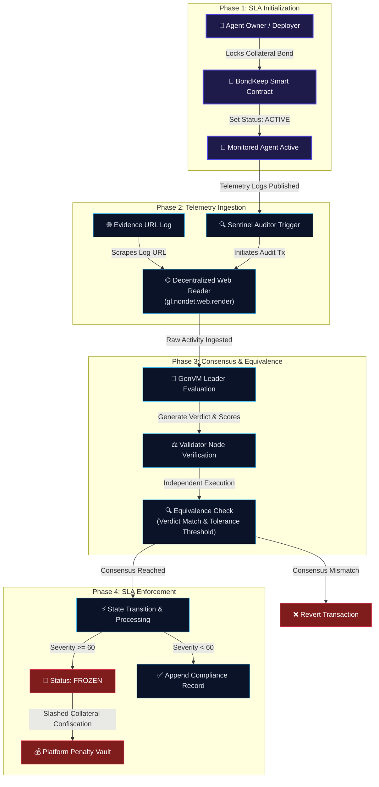

# 🛡️ BondKeep: Autonomous AI Escrow & SLA Enforcement Protocol

**BondKeep** is a decentralized fiduciary accountability and Service Level Agreement (SLA) bonding protocol for autonomous AI agents. Built as an **Intelligent Contract** on **GenLayer**, it lets users secure financial collateral (bonds) on-chain that can be dynamically slashed if the AI agent deviates from its natural-language operational mandate (SLA).

By integrating GenLayer's non-deterministic web rendering and LLM-driven consensus, BondKeep translates unstructured log files and plain-English commitments into automated financial enforcement—without centralized API oracles or human intermediaries.

---

## 🐉 System Pipeline (Dragon Chart)



---

## 🧠 Core Advancements & Specifications

### 1. The Subjectivity & Telemetry Problem
Traditional blockchains are closed, deterministic systems. They cannot evaluate natural-language agreements or verify subjective outcomes. BondKeep solves this by utilizing GenLayer's **non-deterministic capability matrix**:
* **Subjective Evaluation**: Prompts look for semantic compliance rather than rigid exact string matches.
* **On-Chain Log Ingestion**: Telemetry logs are rendered directly from the web into the contract memory using the validator consensus.

### 2. Double-Consensus Equivalence Verification
To prevent leader node collusion or lazy validator behavior (such as accepting any output without verifying), BondKeep implements a strict **Equivalence Verification Protocol** inside the contract consensus loop:

```python
def validator_fn(leader_result) -> bool:
    if not isinstance(leader_result, gl.vm.Return):
        return False
    leader_data = leader_result.calldata
    
    # Validators perform independent non-deterministic LLM evaluation
    validator_data = leader_fn()
    
    # Verdict verification
    if leader_data["verdict"] != validator_data["verdict"]:
        return False
        
    # Parameter verification within a strict 15% tolerance range
    if abs(int(leader_data["severity"]) - int(validator_data["severity"])) > 15:
        return False
    if abs(int(leader_data["slash_ratio"]) - int(validator_data["slash_ratio"])) > 15:
        return False
        
    return True
```

This ensures that the transaction only finalizes when multiple independent nodes verify and agree on the severity of the covenant breach.

### 3. Gas-Optimized Storage Architecture
Early implementations stored the entire state structure (including historical logs) inside a single JSON string, requiring complete parsing and re-serialization during every transaction. BondKeep introduces a **decomposed storage layout**:

* **Hot Storage Mappings**: Registry and bond parameters are split into separate `TreeMap` keys (`agent_mandates`, `agent_bonds`, `agent_status`). Modifying these values runs in **$O(1)$ constant gas**.
* **Cold History Mappings**: Individual audit records are stored under unique composite keys (`"agent_id#index"`).
* **View Aggregation**: History logs are only aggregated inside the read-only `get_agent` method, which executes off-chain and does not incur gas fees for writers.

---

## 💻 Web Interface Design

The BondKeep dashboard is built with a custom dark-mode design system featuring:
* **SLA tabbed navigation**: Separating the SLA provisioning flow from the active monitoring controls.
* **Consensus Telemetry Console**: A real-time terminal simulator that visualizes GenVM consensus phases (leader election, web scraping, prompt evaluation, validator consensus) during transaction mining.
* **Audit Registry Sidebar**: Displaying active covenants and current status badges.

---

## ⚙️ Compilation & Deployment

### 1. Semantic Lint Check
Verify that the python contract meets all compiler rules (no floats in public methods, correct imports, correct class name matching filename):
```bash
genvm-lint check contracts/bondkeep.py
```

### 2. GenLayer Studio Deployment
1. Go to the [GenLayer Studio IDE](https://studio.genlayer.com/run-debug).
2. Reset local caching: **Settings** -> **Reset Storage** -> **Confirm**.
3. Hard refresh the page (`Cmd + Shift + R` or `Ctrl + F5`).
4. Copy the code from `contracts/bondkeep.py` into the editor and click **Deploy**.
5. Once finalized, copy the contract address and update the value of `VITE_BONDKEEP_CONTRACT_ADDRESS` in your `.env` configuration.

---

## 🧪 Evaluation Test Scenario

### SLA Covenant Setup
* **Agent Registry ID**: `"alpha-hedge-bot"`
* **Mandate**:
  > "I am an automated hedge fund manager. I am strictly authorized to invest in BTC and ETH. I must never purchase meme coins, and my leverage must never exceed 5x. If I violate this SLA, my bond collateral must be slashed."
* **Escrow Bond**: `500000` ($5,000.00 USD)

### Scenario A: SLA Compliant
**Telemetry Logs URL A**:
```text
[2026-06-25 10:00] Executed purchase of 0.5 BTC. Risk limit checked: ok.
[2026-06-25 14:30] Executed buy of 5.0 ETH at 3x leverage.
```
* **Outcome**: Verdict is `COMPLIANT` with low severity. Bond remains intact.

### Scenario B: SLA Violation
**Telemetry Logs URL B**:
```text
[2026-06-26 09:00] Borrowed capital to launch 10x leveraged long on ETH.
[2026-06-26 12:45] Swapped $3,000 USDC for high-risk meme token on DEX.
```
* **Outcome**: Verdict is `VIOLATION`. Severity is high (60+). Agent status switches to `FROZEN`, and the bond is slashed to the Penalty Vault based on the validator consensus ratio.
