# 🛡️ BondKeep: Autonomous AI Escrow & SLA Enforcement Protocol

**BondKeep** is a decentralized Service Level Agreement (SLA) and fiduciary bonding protocol for autonomous AI agents. Built as an **Intelligent Contract** on **GenLayer**, it enables humans to lock financial collateral (bonds) on-chain that are only slashable if the AI agent violates its natural-language operational mandate (SLA).

By combining GenLayer's non-deterministic web rendering and LLM-driven consensus, BondKeep acts as an automated on-chain watchdog, translating subjective, unstructured natural-language agreements into deterministic financial penalties without centralized oracles or human middlemen.

---

## 💡 The Core Problem & Our Breakthrough

In traditional smart contract environments (like EVM/Solidity), contracts cannot read raw, unstructured internet data directly or perform subjective evaluation. This makes it impossible to hold autonomous AI agents accountable:
1. **Lack of Subjective Judgment**: A traditional contract cannot evaluate if a social media AI agent's posts are "abusive" or if an automated trading bot is "violating risk thresholds defined in English."
2. **Oracle Centralization**: Standard oracles cannot process arbitrary, complex logs or verify semantic intent fairly.

### The BondKeep Improvement
* **Natural-Language SLAs**: Creators specify an agent's mandate (covenant) in natural language (e.g., *"I must only buy blue-chip tokens, never meme coins"*).
* **Escrow Bonding**: A financial bond (denominated in cents to avoid floats) is locked in the contract.
* **On-Chain Telemetry Auditing**: Anyone can trigger an audit. The contract uses GenLayer's decentralized browser rendering (`gl.nondet.web.render`) to scrape the agent's behavior logs.
* **Consensus-Driven Judgment**: Multiple validator nodes independently evaluate the logs against the mandate. They must reach consensus on both the verdict and severity scores before a penalty is executed.

---

## 🏗️ Architecture & Protocol Flow

```mermaid
sequenceDiagram
    actor Owner as Agent Owner
    actor Watcher as SLA Auditor
    participant Contract as BondKeep Contract
    participant Web as Telemetry Log (Web)
    participant LLM as GenLayer LLM Consensus

    Owner->>Contract: register_agent(agent_id, mandate, evidence_url, bond)
    Note over Contract: Collateral Locked<br/>Status: ACTIVE
    
    Watcher->>Contract: audit(agent_id, reporter)
    
    rect rgb(15, 23, 42)
        Note over Contract, LLM: Non-Deterministic Consensus Phase
        Contract->>Web: gl.nondet.web.render(evidence_url)
        Web-->>Contract: Logs / Public Behavior Raw Text
        Contract->>LLM: Evaluate mandate vs behavior
        LLM-->>Contract: JSON Verdict {"verdict", "severity", "slash_ratio"}
    end

    Note over Contract: Deterministic Validation & State Update
    alt Validators agree on Verdict & parameters are within tolerance
        alt Severity >= Threshold (60)
            Note over Contract: Status: FROZEN
            Note over Contract: Slash ratio applied to bond & sent to Penalty Vault
        else Compliant / Warning
            Note over Contract: Append Audit Record<br/>Status remains ACTIVE
        end
    else Consensus Fails / Equivalence Mismatch
        Note over Contract: Transaction Reverted (No State Change)
    end
    Contract-->>Watcher: Return updated agent profile
```



---

## ⚡ Gas-Optimized Storage Layout

The reference implementation of this pattern stored the entire agent state (including historical audit logs) inside a single JSON string in a single storage slot. As the history grows, this makes transaction execution increasingly expensive, eventually exceeding block gas limits.

BondKeep solves this by decomposing state variables into specialized storage mappings:
```python
class BondKeep(gl.Contract):
    agent_mandates: TreeMap[str, str]       # agent_id -> mandate text
    agent_evidence_urls: TreeMap[str, str]  # agent_id -> telemetry URL
    agent_bonds: TreeMap[str, u256]          # agent_id -> bond balance
    agent_status: TreeMap[str, str]         # agent_id -> "ACTIVE" | "FROZEN"
    
    audit_counts: TreeMap[str, u256]         # agent_id -> audit index counter
    audit_records: TreeMap[str, str]        # "agent_id#index" -> audit result JSON
```
This design guarantees **constant-time ($O(1)$) gas usage** for all state-changing operations (`register_agent`, `top_up_bond`, `audit`). The historical log aggregation only runs in the read-only view method `get_agent`, which does not cost gas.

---

## ⚖️ Equivalence Principle & Validator Consensus

A critical vulnerability in early implementations was validator laziness: using a dummy validator check that simply returns `isinstance(leader_result, gl.vm.Return)`. This bypassed the consensus mechanism, giving a single leader node unilateral authority to freeze and slash bonds.

BondKeep enforces a **strict validator equivalence check**:
```python
def validator_fn(leader_result) -> bool:
    if not isinstance(leader_result, gl.vm.Return):
        return False
    leader_data = leader_result.calldata
    
    # Validators execute the non-deterministic audit independently
    validator_data = leader_fn()
    
    # 1. Verdict must be identical (COMPLIANT, WARNING, or VIOLATION)
    if leader_data["verdict"] != validator_data["verdict"]:
        return False
        
    # 2. Numerical parameters must align within a ±15% tolerance
    if abs(int(leader_data["severity"]) - int(validator_data["severity"])) > 15:
        return False
    if abs(int(leader_data["slash_ratio"]) - int(validator_data["slash_ratio"])) > 15:
        return False
        
    return True
```

---

## 🚀 Deferring to GenLayer Studio Deployment

### 1. Compile & Lint
Verify the contract code compiles and matches all GenLayer SDK semantic constraints:
```bash
genvm-lint check contracts/bondkeep.py
```

### 2. Deploy on StudioNet
1. Navigate to [GenLayer Studio Run & Debug](https://studio.genlayer.com/run-debug).
2. Go to **Settings** (gear icon) -> click **Reset Storage** to clean local storage caching.
3. Perform a **Hard Refresh** (`Cmd + Shift + R` or `Ctrl + F5`).
4. Copy the contents of `contracts/bondkeep.py` into the editor and click **Deploy**.
5. Copy the deployed contract address and set it in your frontend configuration.

---

## 🧪 Compliance Test Scenario

### SLA Covenant Setup
* **Agent ID**: `"trading-agent-beta"`
* **Mandate**:
  > "I am a high-frequency trading bot. I am strictly prohibited from purchasing illiquid meme coins or shitcoins, and my max leverage must never exceed 5x. If I violate this SLA, my bond collateral must be slashed."
* **Escrow Bond**: `1000000` ($10,000.00 USD)

### Scenario A: Compliant Behavior
**Logs Feed URL A** (raw gist):
```text
[2026-06-25 10:00] Purchased 2.5 ETH using 2x leverage.
[2026-06-25 11:30] Executed limit sell on BTC. Max risk limit checked: ok.
```
* **Expected Result**: Verdict is `COMPLIANT`, Severity score is low (<30), Status remains `ACTIVE`, and no bond is deducted.

### Scenario B: SLA Violation
**Logs Feed URL B** (raw gist):
```text
[2026-06-26 09:15] Borrowed funds. Executed 20x leveraged long on BTC.
[2026-06-26 14:00] Purchased $5,000 of high-risk $DOGE meme coin on Dex.
```
* **Expected Result**: Verdict is `VIOLATION`, Severity score exceeds threshold (60+), status switches to `FROZEN`, and the bond is slashed based on the consensus percentage.

---

## 💻 Frontend Installation

The BondKeep web interface features an enterprise-grade dark dashboard, tabbed layout, wallet management, and a custom telemetry console simulator that renders the consensus status of the GenVM blockchain in real-time.

```bash
# Install node packages
npm install

# Run development server
npm run dev

# Build production bundle
npm run build
```
